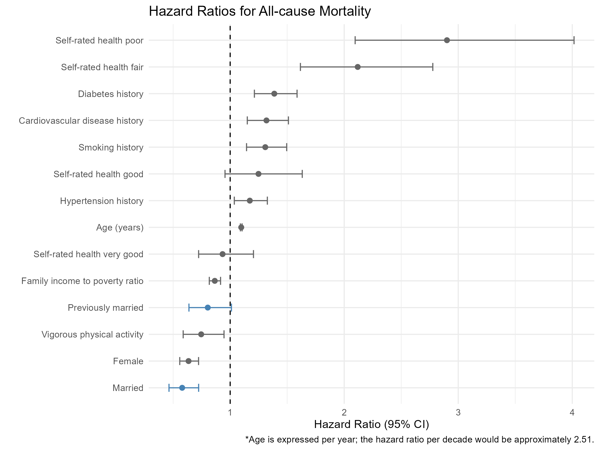

# Marital Status and All-Cause Mortality in U.S. Adults: A Survey-Weighted Survival Analysis
**Author:** Mike Zhang — [GitHub](https://github.com/BigMikeZ)

[View Full Report Here](https://bigmikez.github.io/nhanes_survival/)

## Project Overview
Using five pooled cycles of NHANES data (2005–2014) linked to the National Death Index, a survey-weighted Cox proportional hazards model was fitted to estimate the association between marital status and all-cause mortality.

## Data
All the data involved in this analysis came from the National Health and Nutrition Examination Survey (NHANES) conducted by the U.S. Centers for Disease Control and Prevention every two years. Specifically, cycles 2005-2014 were selected to ensure adequate mortality follow-up prior to the NDI linkage cutoff of December 2019. Data are publicly available at [CDC NHANES](https://www.cdc.gov/nchs/nhanes/) and [CDC Mortality Linkage](https://ftp.cdc.gov/pub/Health_Statistics/NCHS/datalinkage/linked_mortality/).

## Key findings


The analysis demonstrated that married participants had a 42% lower instantaneous mortality rate than never-married participants (HR = 0.58, p < 0.001). Previously married individuals also had a 20% lower hazard, though non-significant, than never-married individuals (HR = 0.80, p = 0.062). Self-rated health was also found to be a strong predictor of mortality risk. When compared with those who rated their health as excellent, people with fair self-rated health had more than twice the mortality risk, and those with poor health nearly three times the risk (HR = 2.12, p < 0.001; HR = 2.9, p < 0.001). 

## Tech Stack
- **Language:** R
- **Data import, merge, & transformation:** `tidyverse`, `haven`, `nhanesA`, `glue`
- **Construct weighted survey data**: `survey`
- **Survival survey data analysis**: `survival`
- **Survival curves plotting**: `survminer`
- **Model parameter extraction**: `broom`
- **Summary table generation and save**: `gtsummary`, `gt`
- **Directory setting in Quarto Markdown**: `here`

## Reproducing the Analysis
1. Clone the repository
2. Install required packages (see scripts for full list)
3. Run scripts in order: `01_download_data.R` → `05_visualizations.R`
4. Render `report/nhanes_survival_report.qmd` to generate the final report

## Repository Structure 
```
nhanes_survival/
├── data/
│   ├── raw/             # Original unmodified data files
│   └── processed/       # Processed .rds files output by scripts
├── report/              # Quarto Markdown file with scripts to render final report
├── scripts/             # Run in order (01 → 05) before rendering report
├── output/              # Figures and model objects
│   ├── tables/          # Summary tables of data characteristics and the main Coxph model
│   ├── models/          # Saved Coxph models as RDS files
│   └── figures/         # Forest plot of Coxph model
└── docs/                # Final report rendered as HTML
```
